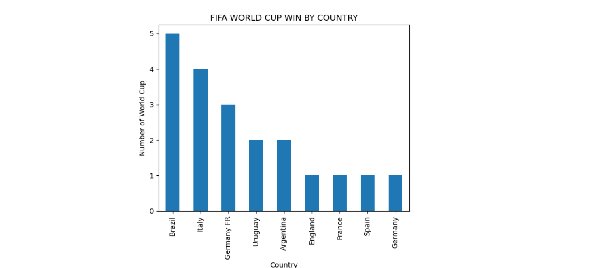

# ⚽ FIFA World Cup Data Analysis

## 📌 Project Overview

This project analyzes historical FIFA World Cup tournament data using Python. The analysis explores tournament statistics such as World Cup winners, runner-up teams, goals scored, attendance, matches played, and qualified teams. Various visualizations are created to identify trends and provide meaningful insights into the history of the FIFA World Cup.

---

## 🎯 Objectives

- Load and explore the FIFA World Cup dataset.
- Perform Exploratory Data Analysis (EDA).
- Analyze tournament winners and runner-up teams.
- Study goals scored, attendance, and matches played.
- Create visualizations using Matplotlib.
- Draw insights from historical tournament data.

---

## 🛠️ Technologies Used

- Python
- Pandas
- Matplotlib
- Jupyter Notebook
- Visual Studio Code

---

## 📂 Dataset

**File:** `WorldCups.csv`

The dataset contains the following information:

- Year
- Host Country
- Winner
- Runners-Up
- Third Place
- Fourth Place
- Goals Scored
- Qualified Teams
- Matches Played
- Attendance

---

## 📊 Analysis Performed

- Dataset exploration
- Data cleaning
- Missing value checking
- Statistical summary
- World Cup winners analysis
- Runner-up analysis
- Goals scored analysis
- Attendance analysis
- Qualified teams analysis
- Matches played analysis

---

## 📈 Visualizations

The project includes the following visualizations:

- Bar Chart – FIFA World Cup Wins by Country
- Bar Chart – Runner-Up Appearances
- Line Chart – Goals Scored Over the Years
- Line Chart – Attendance Over the Years
- Bar Chart – Qualified Teams by Year
- Line Chart – Matches Played Over the Years
- Pie Chart – Distribution of World Cup Titles
- Histogram – Goals Scored Distribution

---

## 🔍 Key Insights

- Brazil has won the highest number of FIFA World Cups.
- Attendance has generally increased over the years.
- The number of participating teams has grown over time.
- More matches are played in modern World Cups compared to earlier tournaments.
- Data visualization helps identify long-term trends in FIFA World Cup history.

---

## 📸 Project Screenshots

### RUNNERS-UP APPEARENCES

---

### GOALS SCORED OVER THE YEARS

---

### ATTENDANCE OVER THE YEARS

---

### QUALIFIED TEAMS

---

### MATCH PLAYED

---

### DISTRIBUTION of WORLD CUP TITLES

---

### DISTRIBUTION of GOALS

---

### FIFA WORLD CUP WIN BY COUNTRY

